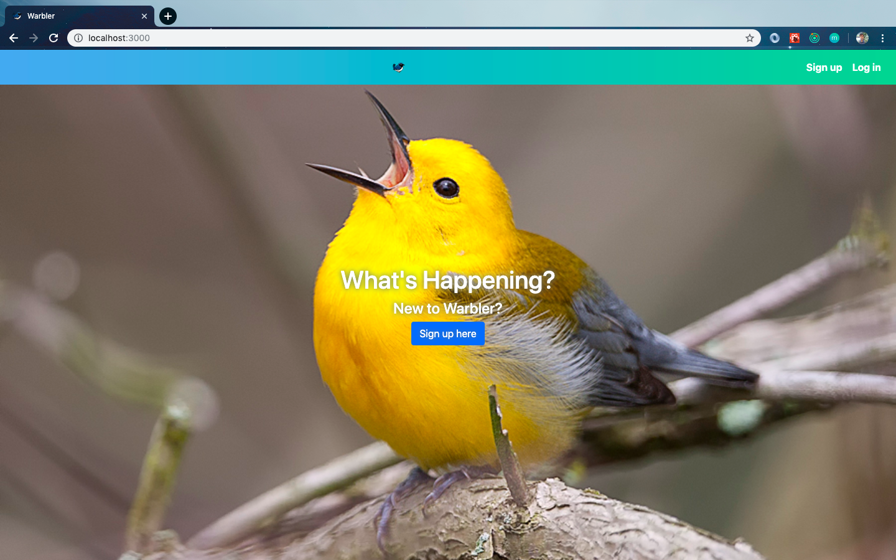
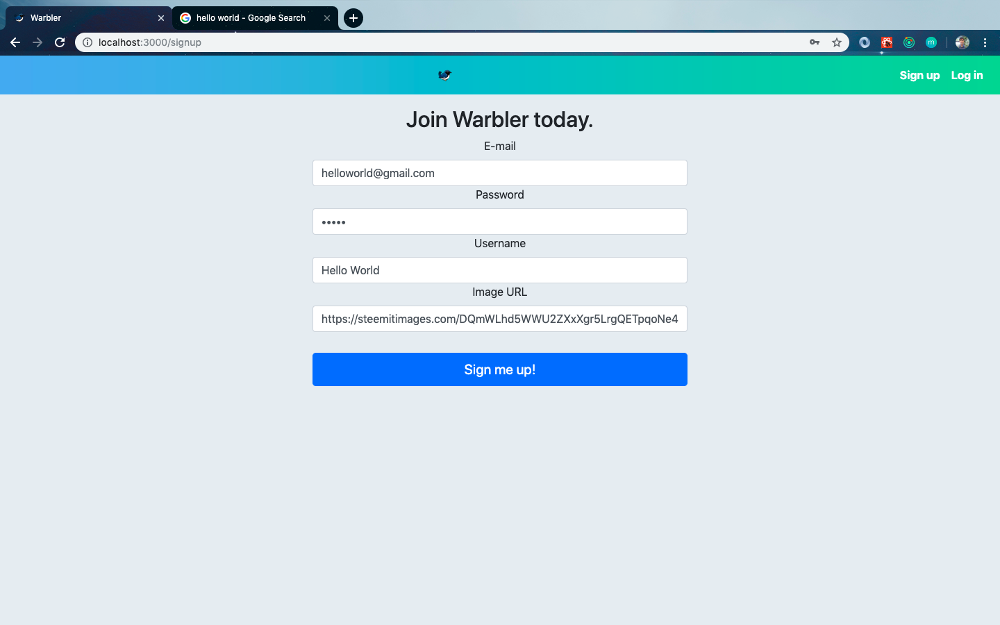
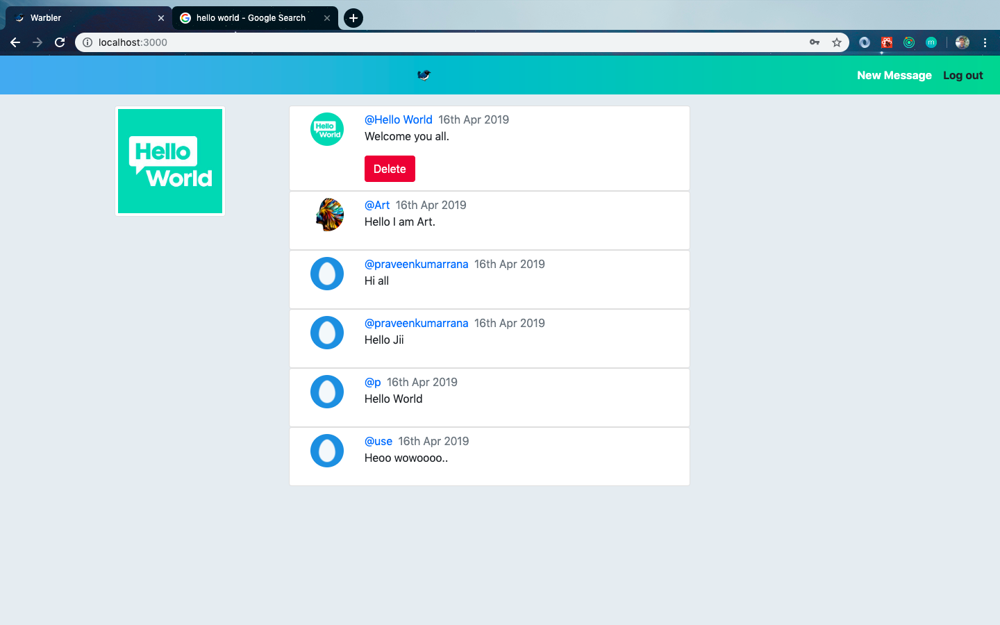

# Warbler
    - The final project in Advanced Webdevelopment Bootcamp.
    - Using React, Node, Redux, MongoDB etc.

### Landing Page
- Welcome message will be displayed here.  

### Sign up Page
- With the help of this form you can do both things of singing or signup depending on condition extra form appear or disappear. On error , error message will be shown.

### Message Page
- Public message area. Your message will be public here though only you can delete it.

**Hope You will Enjoy This Project.**  
_Happy Coding._